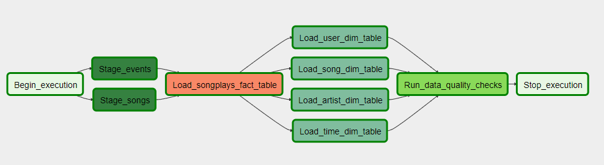
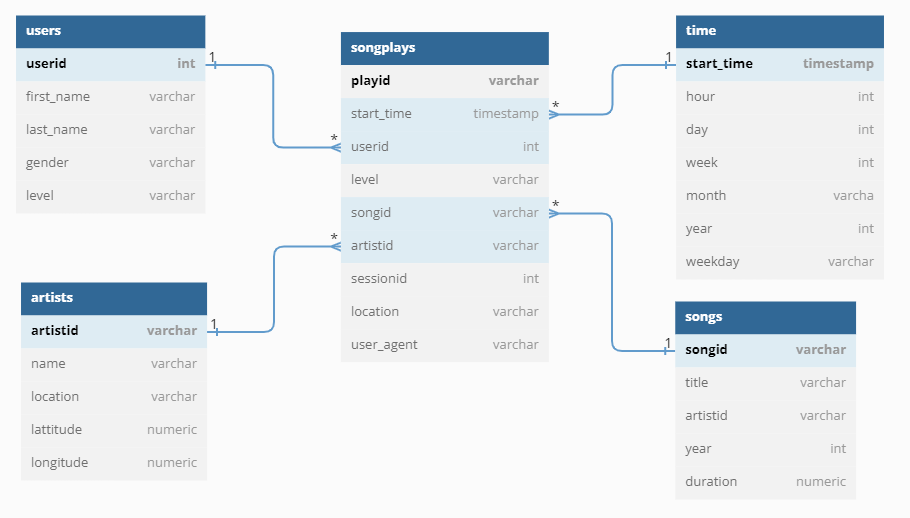

# Project 4 - Automate Data Pipelines with Airflow

As in the previous project this project 4 deals with the music-streaming-dataset of the startup *Sparkify*. In order schedule and monitor data pipelines **Apache Airflow** is used to orchestrate an ETL extracting data from **S3** and loading it into a **Redshift** database.

---

## Data Pipeline with Airflow

Schematic overview of the hourly Airflow Orchestration:

1. In *stage_events* and *stage_songs* data is extracted from S3 and saved into the two staging tables *staging_events* and *staging_songs* in Redshift. The tables contain raw user behaviour from *Sparkify* and a open source song library.
2. In *load_songplays_fact_table* both staging tables are merged and transformed into the fact table *songplays* through an SQL query.
3. In 4 *load_dim_tables*-operators unique values are extracted from the staging tables and are stored into the 4 dimension tables *users*, *songs*, *artists* and *time* through SQL queries.
4. In *run_data_quality_checks* quality checks are performed on all 5 tables in order to ensure integrity of the data and check if the ETL ran correctly.

## Redshift Data Model

The final Redshift star schema consists of 1 fact table and 4 dimension tables:

